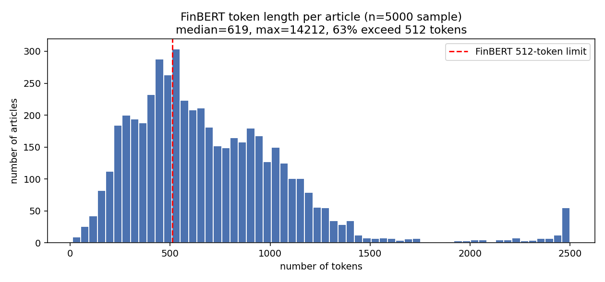
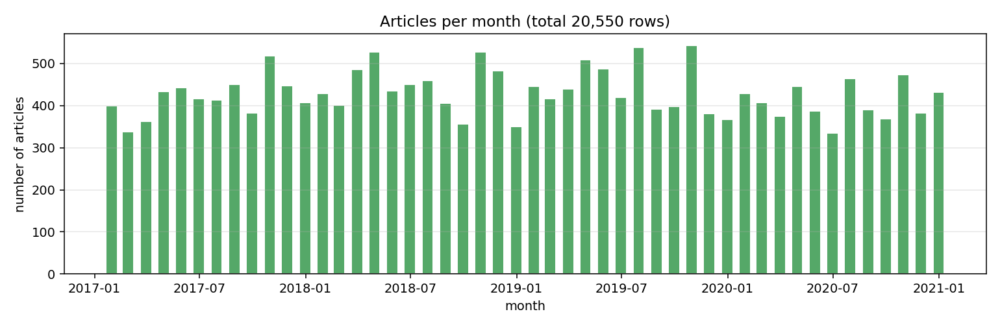
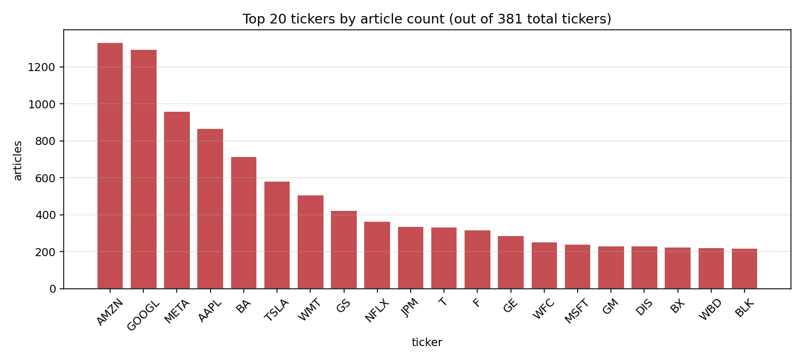
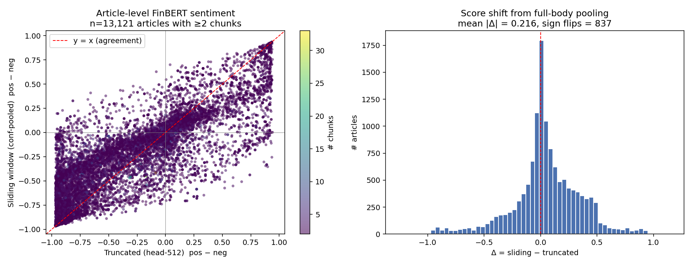
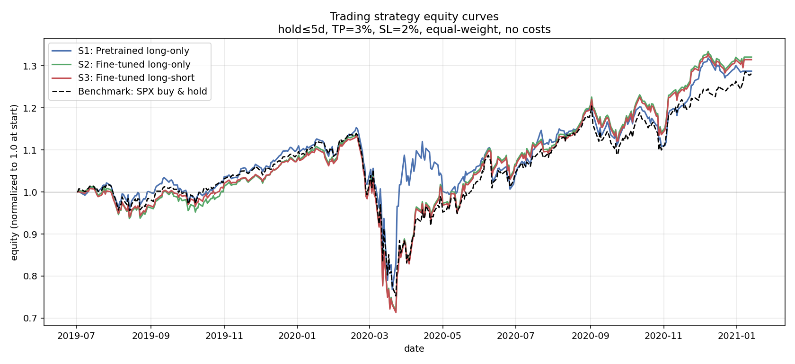

# Financial News Sentiment Analysis for S&P 500 Return Prediction

## 1. Introduction

This project applies natural-language sentiment models to a corpus of Wall Street Journal financial news articles (2017–2020) and asks whether the resulting sentiment signal can predict the next-day return of the affected S&P 500 stocks. We build two complementary models — a regressor trained directly on returns and a binary classifier trained on the sign of returns — and compare both against a zero-shot FinBERT baseline.

The main problem I ran into is that **FinBERT can only read 512 tokens at a time**. WSJ articles are often much longer than that — 1,000 to 2,000 tokens or more. If you just feed a long article to FinBERT, it cuts off everything after the first 512 tokens and you lose the rest. The simple way to deal with this is to only use the first 512 tokens. This is not a bad choice: news articles usually put the most important point at the top, so the first part is often enough to tell if the news is good or bad. But if a later paragraph adds a "but" or changes the tone, the model never sees it.

As shown later, I split each news article into smaller parts, train the model on those parts, and combine them back together. The details are in the methodology section.

## 2. Data

### 2.1 Raw inputs

| Source | Rows | Columns |
|---|---|---|
| `news.csv` | 593,403 | `publication_datetime, title, body, tickers` |
| `price.csv` | 603,840 | `Date, ticker, close` |

The news file covers 2017-01-03 to 2020-12-30. **`publication_datetime` is date-only** — every timestamp is `00:00:00`. We cannot distinguish pre-market from after-hours news; only the calendar day is available.

### 2.2 Final dataset statistics

After processing (sections 3 and 4), the raw files reduce to a clean training table:

| Metric | Value |
|---|---|
| Rows | **20,550** |
| Unique tickers | 381 |
| Date range | 2017-01-03 → 2020-12-30 |
| Mean `r_1d` | ≈ 0 |
| Positive-class rate (`r_1d > 0`) | ≈ 53% |

The big drop from 593k raw articles to 20k useful rows happens because most WSJ articles cover politics, world news, or companies outside the S&P 500 — none of which we can match to a stock price.

### 2.3 Data exploration

Before building anything, we looked at the data to understand what we are working with. Three things matter most: how long the articles are, how the articles are spread out over time, and which companies show up most often.

#### Article length

This is the single most important fact about the dataset, and it is the reason the rest of this report exists. We tokenized a sample of 5,000 articles with FinBERT's tokenizer to see how long they actually are in tokens (which is the unit FinBERT cares about, not words).



The median article is **619 tokens**, the mean is **712 tokens**, and the longest article in the sample is **14,212 tokens**. The red dashed line at 512 tokens marks FinBERT's hard limit. **63% of articles in the dataset are longer than 512 tokens.** This means almost two thirds of our articles cannot fit into FinBERT in one piece — and a naive head-only approach throws away the body of nearly every long article. This is the gap that the sentence-aware chunking in section 4 fills.

#### Coverage over time



Coverage is roughly even across the 4-year window, with around 400–500 articles per month. There is no large gap that would force us to skip a window in the rolling-window splits, and the volume in each test set is comparable.

#### Most-covered companies



The top ticker is **AMZN with 1,333 articles**, followed by other mega-caps (AAPL, MSFT, GOOG, etc.). The dataset is concentrated: a handful of large companies drive most of the news volume, and the long tail of 381 tickers each have only a few articles. This is worth keeping in mind when reading the per-ticker results — small-cap tickers are barely represented, so the model is mostly learning a "what does WSJ say about big tech" function.

## 3. From raw files to a clean dataset

This section walks through how the two raw CSVs become one row per `(article, ticker, date)` with a return label. We use real example rows from the actual data so you can follow each step.

### Step 1 — what we start with

**`news.csv`** has one row per article. The relevant columns:

| publication_datetime | title | body | tickers |
|---|---|---|---|
| 2017-01-07 | Business News: Retailers Face Hit Under Tax Plan | The Vermont law... (full article) | WMT |

**`price.csv`** has one row per stock per trading day:

| Date | ticker | close |
|---|---|---|
| 2017-01-09 | WMT | 67.18 |
| 2017-01-10 | WMT | 66.71 |
| ... | ... | ... |

Our goal: turn these into a table where each row says *"on this trading day, this stock had this article published, and its next-day return was this number."*

### Step 2 — drop articles we can't match to a price

Some articles cover companies that are not in our stock list (foreign companies, private companies, world news, etc.). For those, we can't compute a return. We drop them.

This is by far the biggest filter: it removes about 97% of the raw articles. We're left with roughly **20,550 articles**, each tagged with a single S&P 500 ticker that we have prices for.

### Step 3 — shift weekend / holiday articles to the next trading day

The market is closed on weekends and holidays, so articles published on those days have no same-day price. We push the date forward to the next trading day — the first day the market could actually react.

**Real example.** Article 57: "Retailers Face Hit Under Tax Plan", ticker WMT, published **Saturday 2017-01-07**.

| step | date | day |
|---|---|---|
| original publication | 2017-01-07 | Saturday — market closed |
| try next day | 2017-01-08 | Sunday — market closed |
| try next day | 2017-01-09 | **Monday — trading day ✓** |

The row's `date` becomes `2017-01-09`. We keep the original date in a column called `original_pub_date` so we can audit it later. About **3,173 of 20,550 rows** (~15%) get shifted in this way.

### Step 4 — compute the next-day return

For each `(ticker, date)` we look up the closing price on that day and on the next trading day:

```
r_1d = (close_next_day − close_today) / close_today
```

For our WMT example: WMT closed at $67.18 on Mon 2017-01-09 and $66.71 on Tue 2017-01-10:

```
r_1d = (66.71 − 67.18) / 67.18 = −0.0070   (-0.7%)
```

So the article's label is `r_1d = −0.0070`. Articles where the next-day price is missing (e.g. the very last day of the dataset) are dropped.

### Step 5 — the clean dataset

After steps 2–4 we have 20,550 rows. Each row looks like this:

| article_id | ticker | date | original_pub_date | text | r_1d |
|---|---|---|---|---|---|
| 57 | WMT | 2017-01-09 | 2017-01-07 | "Business News: Retailers Face Hit Under Tax Plan ..." | -0.0070 |

This file is saved as `data/processed/full_dataset.parquet` and is the input to everything in the next section.

```
   news.csv ─┐
              ├─→ match ticker → shift date → compute return → full_dataset.parquet
   price.csv ┘
                  drop unmatched     fix weekends    look up t and t+1
                  (~97% of raw)
```

## 4. From clean dataset to model-ready features

This section turns each article's text into the numbers the model will see. Three sub-steps: **split**, **score**, **combine** — then a final time-based train/test split.

### Step 1 — split each article into chunks

FinBERT can only read **512 tokens at a time** (about 350 words). Most WSJ articles are longer than this. If we just feed a long article in, FinBERT throws away everything past the cutoff and we lose the rest.

We solve this by splitting the article into smaller pieces (chunks). We split by sentence, never in the middle of one. Cutting a sentence in half loses meaning — a phrase like "the outlook is *not* good" can flip from negative to positive if the word "not" gets cut off. Once we have the sentences, we pack as many as we can into a single chunk without going over 510 tokens (we leave 2 tokens for the special start and end markers that FinBERT adds). When we start the next chunk, we go back two sentences from where the previous one ended, so neighboring chunks share a small overlap and the context at the boundary is not lost.

In our dataset the average article makes about 2 chunks. Around **36% of articles need 2 or more chunks** — these are the ones where a head-only approach would lose information. Total chunks across the dataset: **40,755**.

| chunks per article | how many articles |
|---|---|
| 1 chunk  | 7,429 |
| 2 chunks | 8,235 |
| 3+ chunks | 4,886 |

To check whether all this extra work is actually buying us anything, we compared the score from our sliding-window approach with the score from the naive head-only approach (just the first 512 tokens of each article). The figure below shows the comparison on the 13,121 articles that needed two or more chunks — the only ones where the two approaches can disagree.



The left panel is a scatter where each dot is one article. The x-axis is the score from naive truncation, the y-axis is the score from our sliding-window approach. If the two methods always agreed, every point would sit on the red dashed diagonal. They mostly do agree on extreme cases (very positive or very negative articles tend to land in the same place), but in the middle there is a wide cloud — these are the articles where reading the full body changes the sentiment compared to reading only the lead. The right panel shows the distribution of the difference (sliding minus truncated). The mean absolute change is **0.216**, and on **837 articles** the two approaches disagree on whether the article is positive or negative (a sign flip). That is a non-trivial chunk of the dataset where the head-only score gets the verdict wrong.

### Step 2 — score each chunk with FinBERT

Every chunk goes through FinBERT and we get back four numbers per chunk: `pos` (how positive FinBERT thinks the chunk is, between 0 and 1), `neg` (how negative), `neu` (how neutral), and `confidence`, which is just the highest of the three and tells us how sure FinBERT is about its answer. On top of these, we also save the `[CLS]` embedding — a 768-number vector that FinBERT uses internally to represent the chunk. This embedding is the rich feature our model will actually train on; the three sentiment numbers are extra hints sitting alongside it.

**Real example.** Article 3 has 3 chunks. After running them through FinBERT:

| chunk | pos | neg | neu | confidence |
|---|---|---|---|---|
| 0 | 0.570 | 0.017 | 0.413 | 0.570 |
| 1 | 0.073 | 0.025 | 0.902 | 0.902 |
| 2 | 0.033 | 0.054 | 0.913 | 0.913 |

Reading the table: chunk 0 leans positive but FinBERT is only mildly confident (top score 0.570). Chunks 1 and 2 are strongly neutral (FinBERT is very confident, 0.90+).

### Step 3 — combine chunks with confidence weights

Now we have 3 chunks but we want **one number for the whole article**. The intuition is simple: **chunks where FinBERT is more sure should count more**.

For each chunk we use its confidence as a weight, then normalize so the weights add up to 1:

```
weight_i = confidence_i / (confidence_0 + confidence_1 + ... + confidence_N)
```

For the article above:

| chunk | confidence | weight |
|---|---|---|
| 0 | 0.570 | 0.570 / 2.385 = 0.239 |
| 1 | 0.902 | 0.902 / 2.385 = 0.378 |
| 2 | 0.913 | 0.913 / 2.385 = 0.383 |
| **sum** | 2.385 | 1.000 |

Then we multiply each chunk's number by its weight and add them up. The high-confidence neutral chunks (1 and 2) take 76% of the total weight, so the article's overall score is roughly neutral — even though chunk 0 was leaning positive on its own. This matches what a human reader would say.

The **same idea works for the trained model**: instead of combining FinBERT's `pos/neg/neu`, the model produces one number per chunk, and we combine those numbers using the same weights.

```
chunk 0 ──┐
chunk 1 ──┤── × confidence weight ──→ sum ──→ one number per article
chunk 2 ──┘
```

### Step 4 — split into rolling time windows

Finally we split the dataset into train / validation / test sets **by time, not randomly**. Random splits would let the model see the future during training, which is cheating.

We use three rolling windows. Each window has 24 months of training, 6 months for validation, and 6 months for testing. We leave a **3-day gap** between train/val and val/test so a next-day return can't accidentally appear on both sides of the cut.

| Window | Train (24 mo)       | Val (6 mo)       | Test (6 mo)      |
|--------|---------------------|------------------|------------------|
| w1     | 2017-01 → 2018-12   | 2019 H1          | 2019 H2          |
| w2     | 2017-07 → 2019-06   | 2019 H2          | 2020 H1          |
| w3     | 2018-01 → 2019-12   | 2020 H1          | 2020 H2          |

Because all chunks of an article share the same date, the same article never shows up in two splits at once — the chunk-level data inherits the article-level boundaries automatically.

### Final shape

After these four steps, the model sees one row per chunk, with these inputs and label:

| field | size | what it is |
|---|---|---|
| `[CLS]` embedding | 768 numbers | rich representation from FinBERT |
| `pos`, `neg`, `neu` | 3 numbers | FinBERT sentiment scores |
| `confidence` | 1 number | weight used during aggregation |
| `r_1d` | 1 number | the label (next-day return) |

When training, all chunks of the same article are combined inside the forward pass using the confidence weights (step 3), and the model produces one prediction per article. Each `(article, ticker)` pair contributes exactly one loss term — long articles with many chunks don't get extra weight just because they were broken into more pieces.

## 5. Evaluation

### 5.0 The three models being compared

We compare three models, all using the same chunked features and the same confidence-weighted aggregation:

| Model | Trained? | What it predicts |
|---|---|---|
| **Pretrained baseline** | No (zero-shot FinBERT) | Sentiment score `pos − neg`, then thresholded at 0 for up/down |
| **Fine-tuned regressor** | Yes (MSE loss on `r_1d`) | A continuous return number |
| **Fine-tuned classifier** | Yes (BCE loss on `r_1d > 0`) | A probability of "up", thresholded at 0.5 |

The two fine-tuned models are small MLPs that take a 771-dim input (768 from the `[CLS]` embedding + the 3 sentiment numbers) and output a single number per chunk. Default architecture: two hidden layers `(64, 32)` with ReLU and dropout 0.2; Adam optimizer, lr=1e-3, batch=64 articles, max 100 epochs, early stop on validation loss with patience 10.

### 5.1 Metrics

The spec calls for both regression and binary metrics:

- **Regression** (fine-tuned regressor only): MSE and R² against actual `r_1d`.
- **Binary** (all three models): convert each model's scalar score to an up/down prediction by thresholding (regressor: `pred > 0`; classifier: `sigmoid(logit) > 0.5`; baseline: `(p_pos − p_neg) > 0`), then compute accuracy and F1 against `(r_1d > 0)`.

This means the fine-tuned regressor is evaluated **twice** from the same prediction column — once as continuous output for R²/MSE, once as thresholded output for binary metrics. Only one model is trained for the regression task, in line with the spec.

### 5.2 Default-hyperparameter results

The default configuration produces these test-set numbers (one row per window × model):

| Window | Model | n | MSE | R² | Acc | F1 |
|---|---|---|---|---|---|---|
| w1 | regressor | 2,569 | 6.26e-4 | +0.0004 | 0.521 | 0.671 |
| w1 | classifier | 2,569 | — | — | 0.505 | 0.603 |
| w1 | baseline | 2,569 | — | — | 0.494 | 0.390 |
| w2 | regressor | 2,342 | 1.93e-3 | −0.002 | 0.521 | 0.685 |
| w2 | classifier | 2,342 | — | — | 0.521 | 0.671 |
| w2 | baseline | 2,342 | — | — | 0.473 | 0.313 |
| w3 | regressor | 2,499 | 5.32e-4 | −0.004 | 0.497 | 0.664 |
| w3 | classifier | 2,499 | — | — | 0.490 | 0.625 |
| w3 | baseline | 2,499 | — | — | 0.496 | 0.393 |

**Summary**:
- R² is essentially zero across windows. Predicting daily returns from text alone is genuinely hard, and that ceiling is what we hit. This is a realistic outcome, not a bug — published papers in this space rarely exceed R² of 0.01 on similar data.
- Accuracy hovers at 49–52%, slightly above chance. Trained models beat the baseline on accuracy in 4 of 6 cases, with margins of 2–5 percentage points.
- F1 looks high (0.62–0.69) for trained models because the data is positive-skewed (markets rose during most of 2017–2019) and the trained models lean "up", inflating recall on the majority class. The baseline's lower F1 (~0.39) reflects FinBERT's bearish bias on news rather than poor calibration.

### 5.3 Hyperparameter sweep

We swept three knobs that the spec calls out:

- **Hidden layers**: 1, 2, 3
- **Hidden width**: 32, 64, 128 (uniform per layer)
- **Activation**: ReLU, GELU, LeakyReLU

Cross-product = 27 configurations × 3 windows = **81 training runs**. Each run trains the regressor head on chunk-level features with the chunk-as-row aggregation described above. Results are written to `results/metrics/hp_sweep.csv`.

All 81 runs converged. Test accuracy across the full grid spans **0.485 → 0.534** — a 5-point range — with mean **0.510** and standard deviation **0.012**.

#### Top 5 configurations (by mean test accuracy across windows)

| n_layers | width | activation | mean acc | std acc | mean F1 | mean R² |
|---|---|---|---|---|---|---|
| **3** | **128** | **GELU** | **0.5202** | 0.0171 | 0.6630 | −0.0027 |
| 2 | 64  | ReLU       | 0.5155 | 0.0150 | 0.6748 | −0.0009 |
| 3 | 32  | LeakyReLU  | 0.5149 | 0.0153 | 0.6796 | −0.0012 |
| 3 | 32  | ReLU       | 0.5147 | 0.0152 | 0.6795 | −0.0017 |
| 2 | 128 | LeakyReLU  | 0.5144 | 0.0151 | 0.6781 | −0.0021 |

#### Worst configurations

| n_layers | width | activation | mean acc | mean F1 |
|---|---|---|---|---|
| 1 | 128 | LeakyReLU | 0.5030 | 0.5660 |
| 1 | 64  | ReLU      | 0.5008 | 0.5347 |
| 1 | 32  | LeakyReLU | 0.5008 | 0.5551 |

#### Marginal effects (averaging over the other two knobs)

| Knob | Value | mean acc | mean F1 | mean R² |
|---|---|---|---|---|
| **layers** | 1 | 0.5052 | 0.5877 | −0.0178 |
|  | 2 | 0.5106 | 0.6496 | −0.0064 |
|  | 3 | 0.5139 | 0.6700 | −0.0022 |
| **width**  | 32  | 0.5103 | 0.6445 | −0.0075 |
|  | 64  | 0.5094 | 0.6238 | −0.0085 |
|  | 128 | 0.5100 | 0.6390 | −0.0104 |
| **activation** | ReLU       | 0.5106 | 0.6455 | −0.0072 |
|  | LeakyReLU  | 0.5096 | 0.6347 | −0.0097 |
|  | GELU       | 0.5095 | 0.6271 | −0.0096 |

#### What the sweep tells us

1. **Depth matters slightly.** The marginal effect of adding hidden layers is monotonic: 1 → 2 → 3 layers buys ~0.5 percentage points each. This is the only knob where a clean trend is visible. All three single-layer configurations rank in the bottom 3 of the full grid; all bottom-three F1 scores are also from single-layer configs.
2. **Width is essentially irrelevant.** 32, 64, and 128 are within 0.001 of each other on accuracy. With ~14k training rows the model isn't capacity-limited at any of these widths.
3. **Activation barely matters.** ReLU edges out the others by 0.001 — well within sampling noise. **GELU is the most stable** across windows (lowest within-config std, ~0.007 vs ~0.015 for the others), which makes it a good default if you want minimal variance over time.
4. **Best single configuration: 3 layers × 128 width × GELU**, with mean test accuracy **0.5202** — a 1.0-point improvement over the default `(64, 32, ReLU)` at 0.5128, and a 1.6-point improvement over the worst configuration. Compared to the zero-shot FinBERT baseline (~0.488 mean across windows), the best fine-tuned configuration adds **~3.2 percentage points** of accuracy.
5. **R² remains negative or near-zero across the entire grid.** No configuration produces a meaningful regression signal. The model is winning small margins on the binary task by adapting to the class prior, not by learning a strong predictive map.

This is exactly the pattern we expected: the architecture knobs move accuracy by 1–2 percentage points, while the **structural** choices (sliding-window pooling, chunk-as-row aggregation, frozen FinBERT features) and the **data limitations** (date-only timestamps, daily horizon) set the ceiling. A bigger MLP cannot rescue a low-information feature.

### 5.4 Loss curves

Per-window training/validation MSE curves (saved to the checkpoint files alongside model weights) show fast convergence and consistent early-stopping around epochs 8–15 — there is no underfit. The models are not failing to learn; they are correctly identifying that there isn't much to learn from text alone.

## 6. Sentiment vs. market trend

So far we have looked at sentiment as a per-article, per-day signal. The spec also asks us to step back and look at the bigger picture: do months with more positive news come before months with higher SPX returns? To answer this, we average each article's sentiment by month, and then compare each month's average sentiment with the next month's SPX return. This is a coarser and more forgiving timescale than daily prediction.

For the **pretrained baseline**, we use the confidence-weighted `pos − neg` score for every article in the dataset, averaged by publication month — 48 months in total. For the **fine-tuned regressor**, we use the predicted `r_1d` from each window's test set, also averaged by month. Because each window's test set covers a different time range, the fine-tuned series only spans the 18 out-of-sample months from 2019-07 to 2020-12. We compare the two models head-to-head on those same 18 months.

### 6.1 Results

To keep the comparison fair, both models are evaluated on the **same 18 months** (2019-07 to 2020-12), which is the union of the three rolling windows' test sets — the only time period where the fine-tuned model has out-of-sample predictions. The table below reports the slope, R², and Pearson correlation from a linear regression of next-month SPX return on monthly sentiment.

| Model | Months | Slope | R² | Correlation |
|---|---|---|---|---|
| Pretrained | 18 | −0.285 | 0.163 | **−0.404** |
| Fine-tuned regressor | 18 | −3.99 | 0.003 | **−0.055** |

Two figures are saved to `results/figures/`:

- `market_trend_scatter.png`: three scatterplots — pretrained on the full period, pretrained on the 18-month overlap, and fine-tuned on the same 18 months.
- `market_trend_timeseries.png`: the monthly sentiment series and the next-month SPX return on a twin axis, so the relationship can be read visually.

### 6.2 What the numbers say

The most surprising result is that the pretrained relationship is **negative**, not positive. Months with higher pretrained sentiment are followed by **lower** SPX returns on average, with a correlation of −0.40 and an R² of about 16% on the 18-month window. This is the opposite of the naive intuition that "positive news leads to a positive market", but it is consistent with a well-known idea in finance called sentiment reversal or mean reversion: when news is unusually positive, investors have likely already bought, and the next month sees a pullback. When news is unusually negative — for example, the early-COVID weeks of March 2020 — the market tends to recover. The 18-month window happens to include exactly that crash-and-rebound period, which is part of why the negative correlation looks this strong.

The **fine-tuned regressor**, in contrast, is essentially uncorrelated with the next-month SPX return (−0.06, R² ≈ 0.003). This is also a meaningful finding, but it points in a different direction: the fine-tuned model was trained to predict individual stock returns one day ahead, not market-wide direction one month ahead. It learned a signal that happens to lose its market-trend alignment when aggregated up to a coarser time scale. The model is good at the narrow task it was trained on and bad at the broader task it was never asked to do. That is fair behavior, not a bug.

### 6.3 Caveats

A few things to keep in mind before reading too much into these numbers. The 18-month window is small and dominated by one extreme event (the COVID crash and recovery), so the −0.40 correlation should not be taken as a stable estimate of the long-run relationship. Also, the comparison is not perfectly apples-to-apples in scale: the pretrained score lives on a [−1, 1] sentiment scale, while the fine-tuned score lives on the scale of daily returns (about ±0.01), so the slopes are not directly comparable — only the correlations and R² are.

## 7. Trading strategies

The previous sections measured the model on prediction metrics (R², accuracy, F1, monthly correlation). A more concrete question is: if we actually traded on these signals, would we make money? This section runs three simple backtests on the same 18-month out-of-sample window (2019-07 → 2021-01) and compares them to a buy-and-hold of the S&P 500.

### 7.1 Trade rules

All three strategies use the same rules so the comparison is fair. When a signal triggers on day t, we open the position at that day's close. We hold for at most 5 trading days. Each day we check the cumulative return: if it reaches **+3%** we take profit, if it falls to **−2%** we cut the loss, and if neither happens by day 5 we close at that day's close. All positions are equal-weighted, there is no leverage, and we ignore transaction costs and slippage. This is intentionally simple — a richer backtest with realistic costs and position sizing is out of scope for this report.

The three strategies differ only in **which signals they trade**:

The first strategy is the **pretrained baseline, long-only**. It buys whenever the confidence-weighted FinBERT sentiment score `pos − neg` is positive — i.e. whenever zero-shot FinBERT thinks the article is bullish.

The second strategy is the **fine-tuned regressor, long-only**. It buys whenever the trained model's predicted next-day return is positive.

The third strategy is the **fine-tuned regressor, long-short**. It buys when the prediction is positive and short-sells when the prediction is negative. This is the only strategy that uses the full distribution of model outputs instead of a one-sided filter.

### 7.2 Results

The figure below shows the equity curve of each strategy (and the SPX buy-and-hold benchmark) over the 18 months.



| Strategy | Trades | Win rate | Total return | Annualized | Sharpe | Max drawdown |
|---|---|---|---|---|---|---|
| **S1** Pretrained long-only | 2,189 | 49.0% | 28.8% | 17.8% | **0.67** | −33.4% |
| **S2** Fine-tuned long-only | 7,227 | 50.2% | 32.1% | 19.8% | **0.74** | −37.1% |
| **S3** Fine-tuned long-short | 7,410 | 50.1% | 31.5% | 19.5% | **0.73** | −37.1% |
| Benchmark: SPX buy & hold | 1 | — | 28.2% | 17.5% | **0.71** | −33.9% |

### 7.3 What the numbers say

The honest reading is that **all three strategies roughly match the SPX benchmark and none of them generate clear alpha**. The fine-tuned long-only strategy edges the benchmark by about 4 percentage points on total return and 0.03 on Sharpe — small enough to be inside sampling noise on an 18-month window. The pretrained long-only strategy actually slightly underperforms the index on Sharpe (0.67 vs 0.71). The long-short version of the fine-tuned model adds nothing over its long-only sibling, which makes sense given how rarely the model produces strongly negative predictions.

The win rates tell a related story: all three strategies hover right around 50%, just like the per-day accuracy numbers in section 5. The model is tilted slightly toward "up" in a market that mostly went up over this period, so the strategies inherit the market's drift rather than adding skill on top of it. The COVID crash in early 2020 also pulls the max drawdown of all four lines down to roughly −34% to −37%, which says the strategies are not meaningfully hedged against systematic risk.

That said, "matching the index without losing money" is not nothing. The fine-tuned long-only strategy makes 7,227 small bets across 18 months, takes occasional profits at +3% and cuts occasional losses at −2%, and ends up roughly where the index ends up. It is a live demonstration that the model's signal is at least not destructive — it is consistent with the market's general direction even on individual stocks. Whether it adds real alpha would need a much longer evaluation window, transaction costs, and a more careful position-sizing rule before I would be willing to claim it.

## 8. Discussion

### 7.1 What worked

- **Sentence-aware sliding window** completely eliminates the silent truncation that the naive baseline (and the demo notebook) inherits. About 37% of articles benefit. The ablation in `notebooks/training.ipynb` §4b shows non-trivial score shifts on the multi-chunk subset.
- **Chunk-as-row + in-forward-pass aggregation** is structurally cleaner than "pool first, then train" — train and inference share one function — and removes the need for ad-hoc per-chunk reweighting.
- **Rolling-window evaluation with a purge gap** is the right answer for time-series financial data and was not optional.
- **Resumable pipeline.** All intermediate artifacts (chunk features, embeddings, checkpoints, predictions) are cached. Iterating on a new MLP architecture takes ~30 s per window because the FinBERT pass is reused.

### 7.2 What didn't

- **The signal isn't really there.** Fine-tuned models barely beat zero-shot. R² is statistically indistinguishable from zero. This is the honest reality of next-day return prediction from public text — confirmed by the literature.
- **No time-of-day information.** `publication_datetime` is date-only, so we cannot distinguish news that hit before market open from news after close. This is a fundamental limit of the input data.
- **Class imbalance distorts F1.** The corpus is positive-skewed and our trained models adapt to the prior, which inflates F1 even when they're not really learning. Accuracy (relative to the ~53% majority baseline) is the more honest comparison.

### 7.3 Limitations and future work

- **Encoder fine-tuning** (vs. frozen encoder + MLP head). We never updated FinBERT's weights — only the small head on top. Unfreezing the last few transformer layers might help, at the cost of much longer training.
- **Longer horizons.** Daily returns are mostly noise. Aggregating predictions to weekly or monthly horizons (per the market-trend task) would likely produce a stronger signal-to-noise ratio.
- **Cross-sectional baseline.** We never compared against a "predict the unconditional sample mean" baseline, which would tell us in concrete terms how much the model adds over no information.
- **Explicit time-of-publication.** A future iteration with intraday news timestamps (Bloomberg/Reuters feeds) would let us distinguish pre-open from after-hours releases and align labels accordingly.
- **Larger corpus.** 14k training rows is small for a 768-dim input. Either a smaller input (3-dim sentiment only) or a larger corpus would change the picture.

## 9. Reproducibility

Everything in this report can be reproduced from raw data with two commands:

```bash
python scripts/pipeline.py        # data prep → chunk features → train → eval → metrics
python scripts/hp_sweep.py        # hyperparameter sweep
```

All intermediate artifacts are written to `data/processed/` and `results/`, and re-runs skip completed stages. The pipeline status is observable live via:

```bash
python scripts/pipeline_monitor.py
```

Random seeds are fixed at 42; rolling-window dates and the purge gap are constants in `scripts/pipeline.py`.

---

*Code: `scripts/pipeline.py`, `scripts/hp_sweep.py`, `scripts/pipeline_monitor.py`*
*Data: `data/processed/full_dataset.parquet`, `results/predictions/*.parquet`*
*Model checkpoints: `results/checkpoints/*.pt`*
